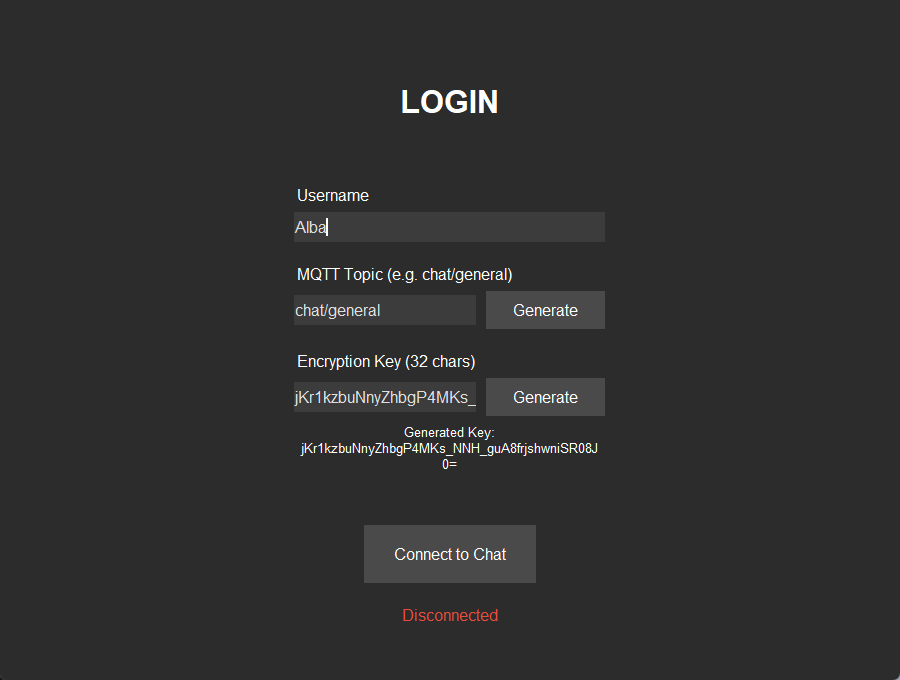
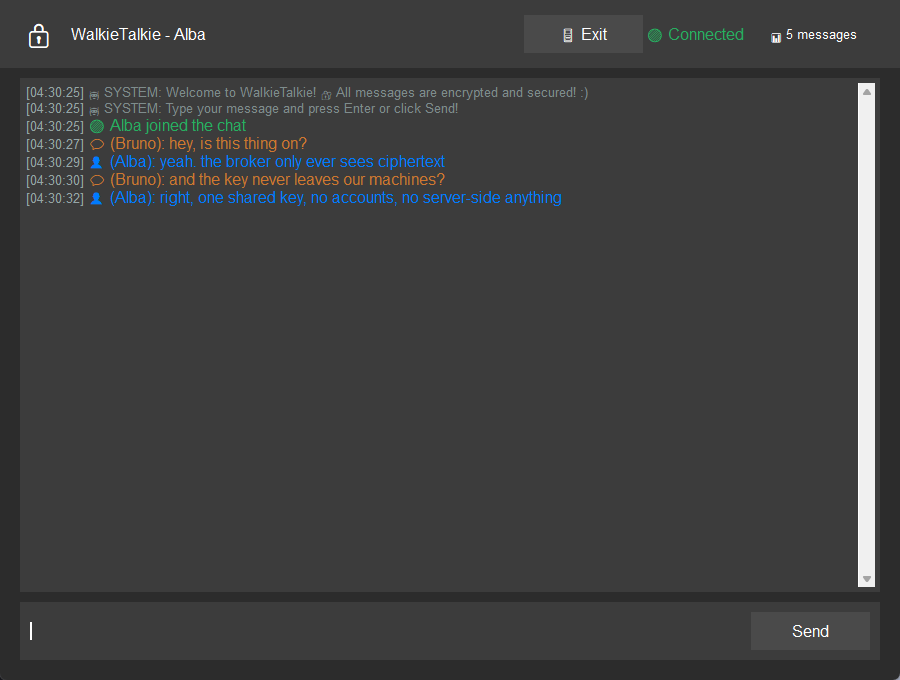

# encrypted-mqtt-chat

A small desktop group chat. Messages travel over MQTT and are encrypted with a
shared key before they leave your machine, so the broker only ever sees
ciphertext. Python and Tkinter, one window, no accounts.

I built this to learn how MQTT publish/subscribe works and what you can and
cannot get from symmetric encryption on top of a channel you do not control.
The "what it does not protect" section below is the honest part.






## How it works

Everyone who wants to talk joins the same MQTT topic and types the same key.
When you send a message the app encrypts it with that key and publishes the
ciphertext to the topic. Every other client on the topic receives it and
decrypts it with their copy of the key. The broker just moves bytes around and
never has the key.

- Transport: MQTT 3.1.1 (`paho-mqtt`), one topic per conversation.
- Encryption: Fernet from the `cryptography` package, which is AES-128 in CBC
  mode with an HMAC-SHA256 authentication tag. Not AES-256, despite what an
  earlier version of this readme claimed.
- Key handling: paste a Fernet key, or press *Generate* to get one and share it
  with the other people out of band. If you type a plain phrase instead, the app
  runs it through PBKDF2-HMAC-SHA256 (600k iterations, fixed salt) to get a key.
- Wrong key on the topic: MQTT topics are open, so anyone can publish to the one
  you are using. If their payload does not decrypt with your key the app prints a
  one-time system notice and ignores the rest, rather than rendering the failure
  as a message.

## What it does not protect

- **The broker sees metadata.** Topic names, message sizes and timing are all in
  the clear. Only the message body is encrypted.
- **One key for everyone, forever.** There is no per-message or per-session key,
  so there is no forward secrecy. If the key leaks, every past message that
  someone captured is readable.
- **The key is on screen.** It sits in a text field on the login window. This is
  a demo, not a threat model where someone is looking over your shoulder.
- **The passphrase path uses a fixed salt.** Deriving a key from a phrase is
  deterministic on purpose (so peers match without a handshake), which means the
  same phrase always yields the same key and the salt can be pre-attacked. Use a
  generated key if you actually care.
- **No TLS to the broker.** The MQTT connection itself is plain TCP. The payload
  is encrypted; the connection is not.

Treat it as: the broker operator and anyone sniffing the broker link cannot read
your messages. That is the whole guarantee.

## Running it

You need Python 3.9+ and a local MQTT broker. The app defaults to
`127.0.0.1:1883` and never talks to a public broker.

### 1. Start a broker

Mosquitto is the easiest:

```
# Debian/Ubuntu
sudo apt install mosquitto
mosquitto -v

# macOS
brew install mosquitto
mosquitto -v

# Windows: install from mosquitto.org, then run
mosquitto -v
```

Or, if you have Docker:

```
docker run --rm -p 1883:1883 eclipse-mosquitto
```

### 2. Start the app

```
pip install -r requirements.txt
python app.py
```

Point it at a broker on another host with environment variables if you need to:

```
MQTT_BROKER=192.168.1.20 MQTT_PORT=1883 python app.py
```

### 3. Talk

Open the app on two machines (or run it twice on one). Use the same topic and
the same key on both. Anything you type on one shows up on the other.

## Tests

```
pip install -r requirements-dev.txt
pytest
```

The suite covers the encryption round trip, the passphrase derivation, rejection
of a wrong key, and that no public broker hostname is left in the source. It does
not need a running broker.

## Building a Windows executable

```
pip install pyinstaller
pyinstaller walkietalkie.spec
```

Output lands in `dist/`.

## Layout

```
app.py            Tkinter GUI: login screen, chat window, message rendering
mqtt_client.py    thin wrapper over paho-mqtt, encrypts on publish / decrypts on receive
encryption.py     Fernet helpers and the PBKDF2 passphrase fallback
resources/        window icon
tests/            pytest suite
```

There is no architecture layer beyond that. The GUI holds a client, the client
holds a cipher, messages flow through both.

## License

PolyForm Noncommercial 1.0.0 — see [LICENSE](LICENSE). Personal and
non-commercial use only. Not for use in a business or a paid product.

## Credits

Solo project. Coursework exercise, 2025.
